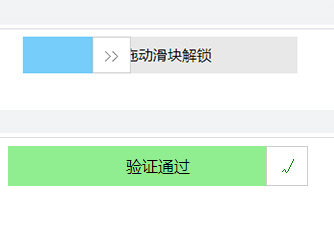
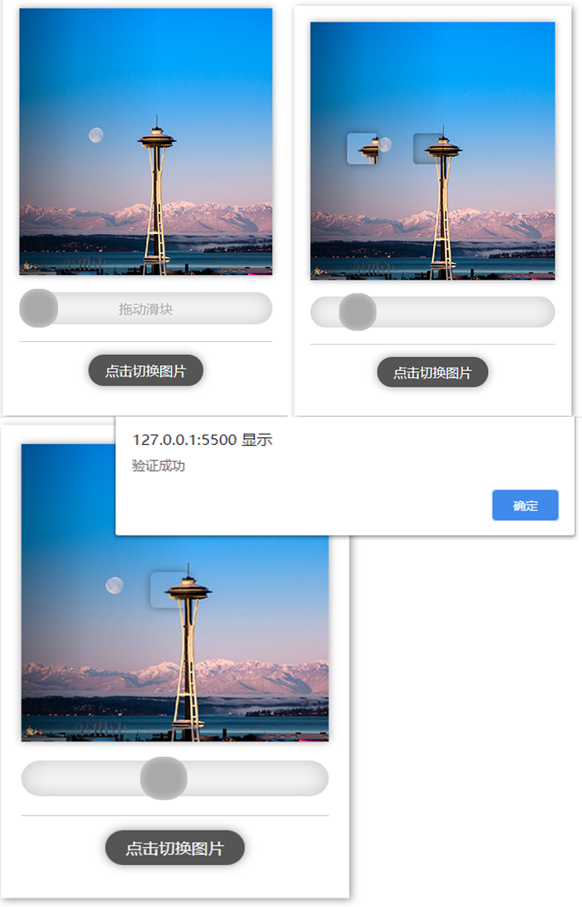

# CAPTCHA
<h3>用js实现各类交互验证码</h3>
<h4>01.进度条拖拽验证</h4>

参考文章：https://www.jb51.net/article/151432.htm 纯js实现 效果：

<h4>02.拼图验证</h4>

参考文章：https://zhuanlan.zhihu.com/p/42082496 js+jQuery 效果：

<h4>03.选字验证</h4>
 原创 js+jQuery 效果：

<h4>04.选图验证</4>

原创 js+jQuery 效果：

